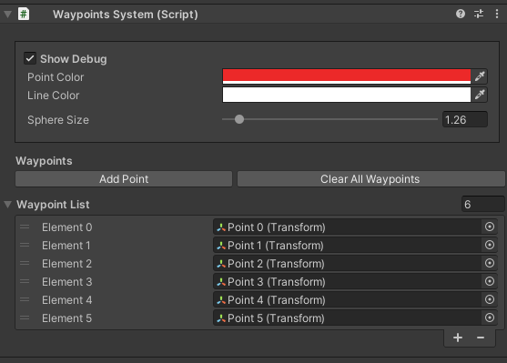

# WaypointSystem
A simple script for Unity that enables your GameObject to move from A - Z and back to A.

### Waypoint Systems Custom Inspector

Source code is documented. 
Will be documented in a later date.
